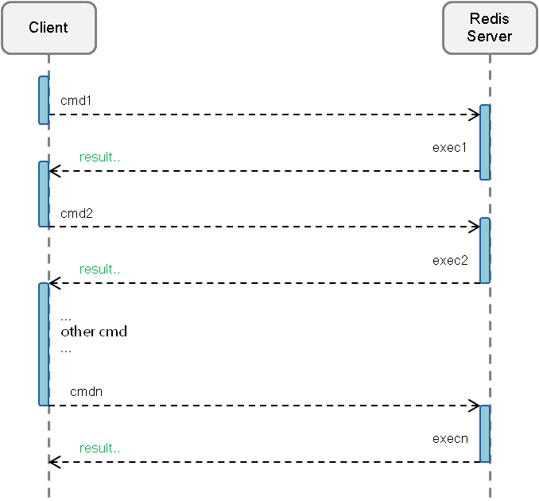
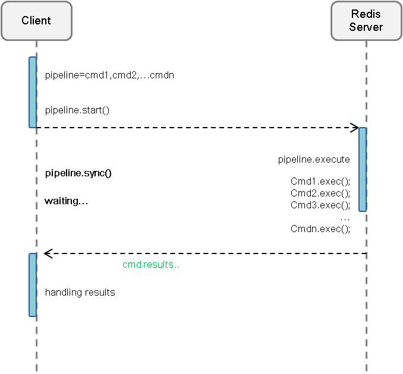
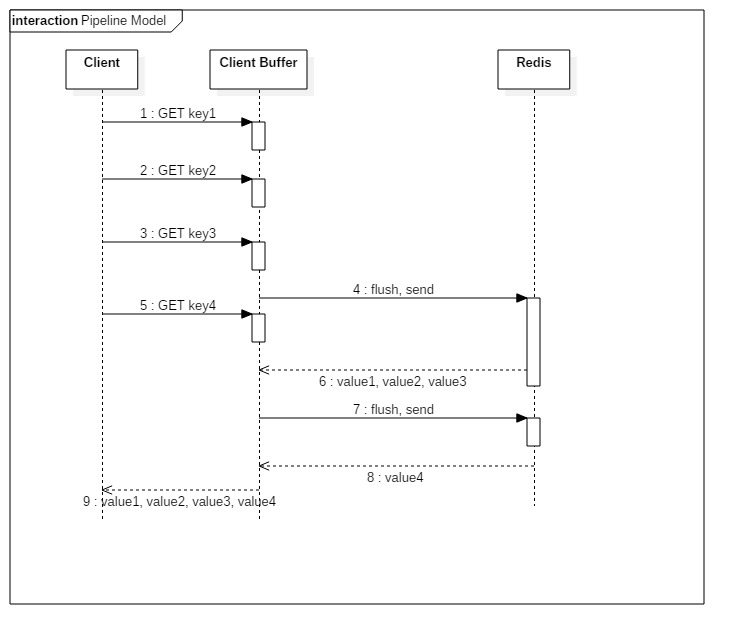
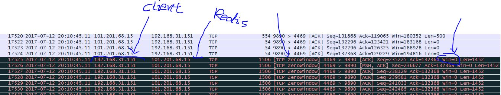
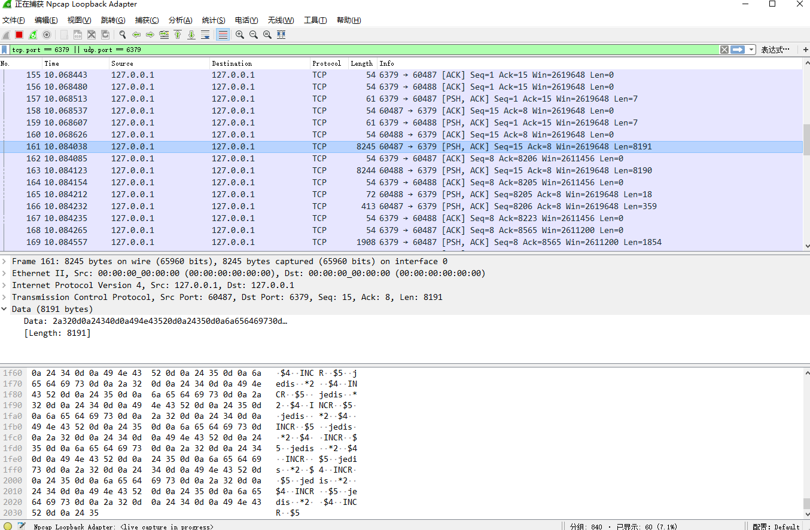
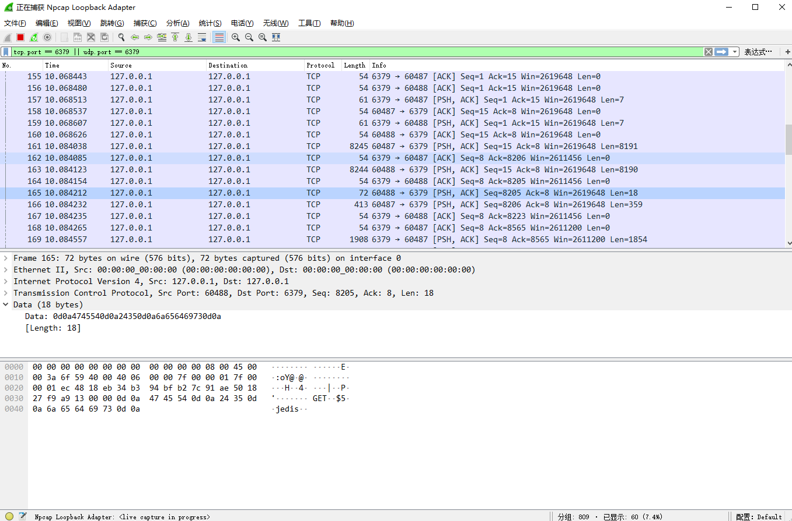
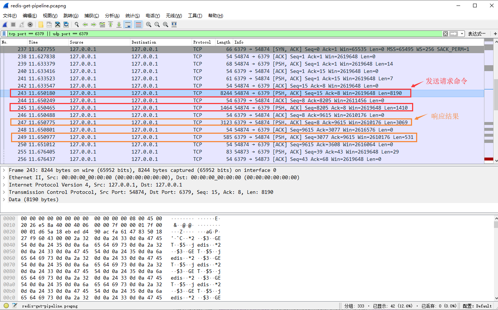
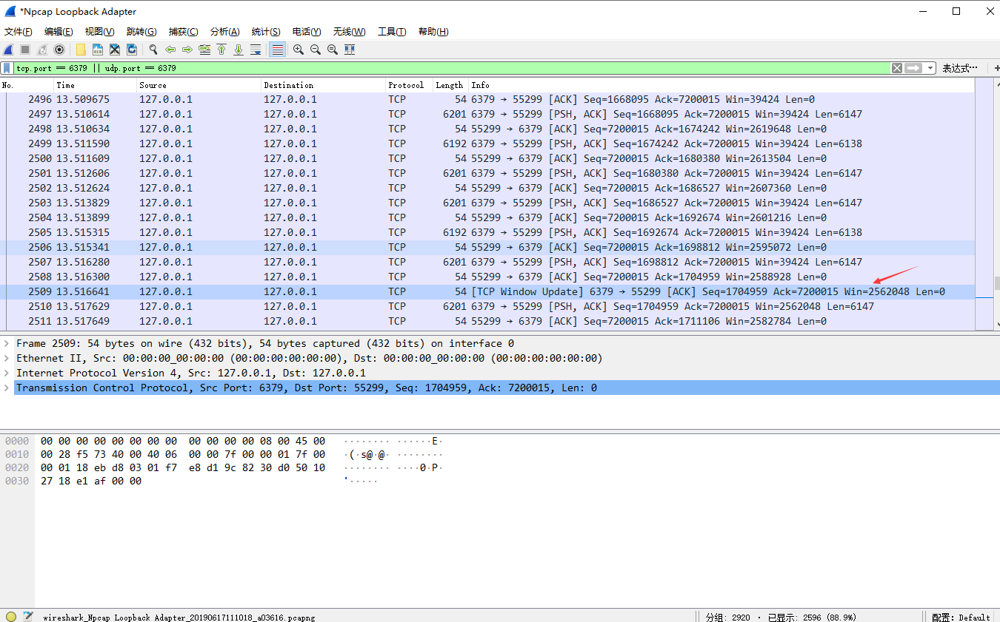
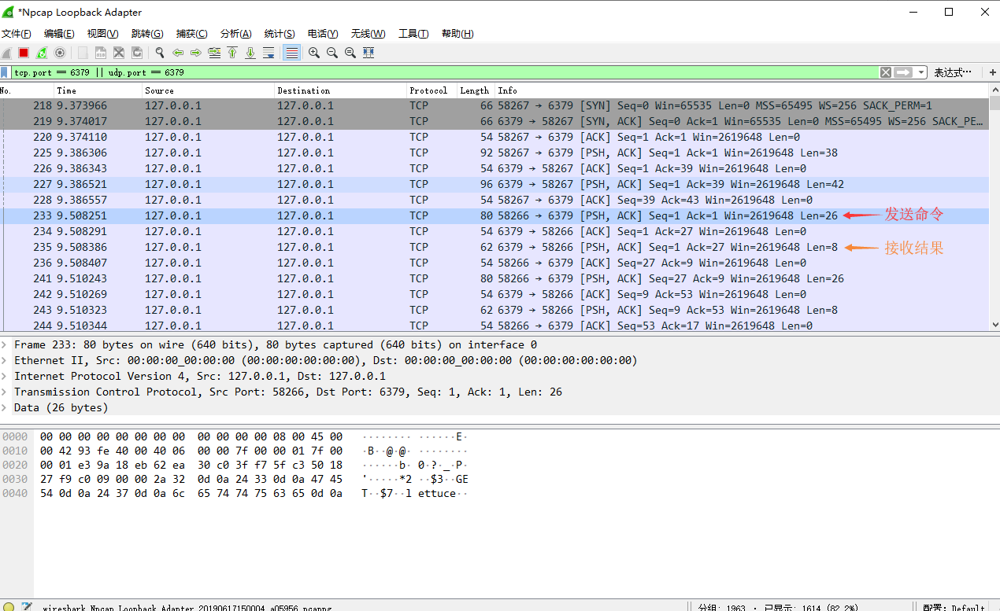

# redis-pipeline

参考: 
  - 《redis开发与运维（付磊）》 3.3.1 Pipeline概念，192/890。
  - [redis.io pipelining](https://redis.io/topics/pipelining)
  - [redis.cn pipelining](http://www.redis.cn/topics/pipelining.html)
  - [redis的MULTI与PIPELINE](https://blog.csdn.net/qmhball/article/details/79074421): 一定要看！
  - [redis中multi和pipeline区别以及效率(推荐使用pipeline)](https://www.cnblogs.com/loveyouyou616/p/5415552.html)

  - [初识pipeline](https://www.cnblogs.com/midhillzhou/p/5588958.html)
  - [分布式缓存Redis之Pipeline（管道）](https://blog.csdn.net/u011489043/article/details/78769428)
  - [Redis Pipeline原理分析](http://php361.com/index.php?c=index&a=view&id=6489)：赞同这个理解！
  - [redis通过pipeline提升吞吐量](https://www.cnblogs.com/littleatp/p/8419796.html)


## pipeline概念
redis-pipeline 技术可以在服务端未响应时，客户端可以继续向服务端发送请求，并最终一次性读取所有服务端的响应。
（摘自 https://www.runoob.com/redis/redis-pipelining.html ）

Redis provides support for pipelining, which involves sending multiple commands to the server without waiting for the replies and then reading the replies in a single step. 
Pipelining can improve performance when you need to send several commands in a row, such as adding many elements to the same List.
（摘自 https://docs.spring.io/spring-data/redis/docs/2.1.8.RELEASE/reference/html/#pipeline）

**pipeline特点：**
1) 需要 客户端 和 服务端 同时提供支持。

2) 有效的减少了RTT和redis连接数，同时也减少了IO调用次数（IO调用涉及到用户态到内核态之间的切换）。

3) pipeline并未保证原子性。即同一个pipeline中的命令在redis-server被执行的顺序可以保证，但不保证其中不会穿插其余的客户端请求的命令。
可以通过redis的slowlog查看命令的执行顺序，以验证此特点。

4) 每次Pipeline组装的命令个数不能没有节制，否则一次组装Pipeline数据量过大，一方面会增加客户端的等待时间，另一方面会造成一定的网络阻塞，可以将一次包含大量命令的Pipeline拆分成多次较小的Pipeline来完成。  
例如，jedis-pipeline每次最大发送字节数为8192。

5) 使用管道发送命令时，服务器将被迫回复一个队列答复，占用很多内存。所以，如果你需要发送大量的命令，最好是把他们按照合理数量分批次的处理。
例如10K的命令，读回复，然后再发送另一个10k的命令，等等。这样速度几乎是相同的，但是在回复这10k命令队列需要非常大量的内存用来组织返回数据内容。  
例如jedis的逻辑是，jedis的默认的接收缓冲区大小是2619648字节，当超过此值，jedis会通知不能再接收redis的响应结果。此时redis会将响应结果维护在redis端的输出缓冲区中。

## 对redis-pipeline的理解
普通请求模型：  


Pipeline请求模型：  


以上图片来至：[redis通过pipeline提升吞吐量](https://www.cnblogs.com/littleatp/p/8419796.html)
对`普通请求模型`没有疑问。但是，个人觉得`pipeline请求模型`这样描述并不完整，或者说我对此理解出现了歧义。

直到看到了以下blog：[Redis Pipeline原理分析](http://php361.com/index.php?c=index&a=view&id=6489)
其中对`普通请求模型`与上篇blog中的描述是一致的，但是对`pipeline请求模型`描述更加详细。  


client这边首先将执行的命令写入到缓冲中（client-buffer），最后再一次性发送Redis。
但是有一种情况是，缓冲区（client-buffer）的大小是有限制的，比如Jedis，限制为8192，超过了，则刷缓存，发送请求到Redis，但是jedis不会去处理Redis的应答，如上图所示那样。


Redis的Pipeline和Transaction（Multi）不同，Transaction会存储客户端的命令，最后一次性执行，而Pipeline则是处理一条响应一条。
但是这里却有一点，就是客户端会并不会调用read去读取socket里面的缓冲数据。
这也就造就了，如果Redis应答的数据填满了该接收缓冲（SO_RECVBUF），那么客户端会通过ACK，WIN=0（接收窗口）来控制服务端不能再发送数据，
那样子，数据就会缓冲在Redis的客户端应答列表里面。所以需要注意控制Pipeline的大小。如下图：  

​​

个人阅读后对blog中的理解：  
blog中提到的`客户端会并不会调用read去读取socket里面的缓冲数据`。  
对此我的理解是，例如图中的`6:value1, value2, value3`，假设client接收到了此response，（假设）并保存在client-receive-buffer（客户端 接收缓冲区），且刚好占满client-receive-buffer。  
但是，client并不会去read，且 client-receive-buffer 被占满，client会通过`ACK, WIN=0`通知redis-server不要再发送响应数据。  
即，`8: value4` 会保存在redis-server端的output-buffer（redis的输出缓冲区）中。直到client开始read client-receive-buffer。

## 测试 pipeline 

|   |    |
|----|----|
| os  | windows10 |
| redis-server | 3.2.100 |
| jedis | 2.9.3|
| spring-data-redis | 2.1.6.RELEASE |
| ettuce | 5.1.6.RELEAS |
| netty | 4.1.34.Final |
| spring-boot | 2.1.4.RELEASE |


### jedis
假设，现在有2个客户端/线程同时向redis发起命令。  
client-01利用pipeline调用1000次 `incr key` ，client-02利用pipeline调用1000次`get key`。

```
/**
 * 针对`get jedis` 大概 341 条命令为一组相同结果。
 * 其单条RESP：`*2\r\n$3\r\nget\r\n$5\r\njedis\r\n` len=24
 * jedis-pipeline的client-buffer限制：8192。8192 / 24 ≈ 341
 *
 * @see RedisOutputStream#RedisOutputStream(java.io.OutputStream) jedis默认限制output-buffer=8192。
 */
@Test(dataProvider = "pipelineData", threadPoolSize = 2, invocationCount = 1)
public void jedisPipeline(boolean flag){
    String key = "jedis";

    Jedis jedis = jedisPool.getResource();
    Pipeline pipeline = jedis.pipelined();
    int num = 0, limit = 1000;
    List<Object> list;

    if (flag){
        while (num++ < limit) {
            pipeline.incr(key);
        }

        list = pipeline.syncAndReturnAll();

        log.info("exec: incr, key: {}, result: {} \r\n", key, StringUtils.join(list, ","));
    }else {
        while (num++ < limit) {
            pipeline.get(key);
        }

        list = pipeline.syncAndReturnAll();
        log.info("exec: get, key: {}, result: {} \r\n", key, StringUtils.join(list, ","));
    }

    jedis.close();
}

@DataProvider(name = "pipelineData", parallel = true)
private Object[][] pipelineData(){
    return new Object[][]{{true}, {false}};
}
```

jedis最终发送命令都是通过源码：
```
// redis.clients.jedis.Protocol#sendCommand(redis.clients.util.RedisOutputStream, byte[], byte[]...)
private static void sendCommand(final RedisOutputStream os, final byte[] command,
    final byte[]... args) {
  try {
    os.write(ASTERISK_BYTE);
    os.writeIntCrLf(args.length + 1);
    os.write(DOLLAR_BYTE);
    os.writeIntCrLf(command.length);
    os.write(command);
    os.writeCrLf();

    for (final byte[] arg : args) {
      os.write(DOLLAR_BYTE);
      os.writeIntCrLf(arg.length);
      os.write(arg);
      os.writeCrLf();
    }
  } catch (IOException e) {
    throw new JedisConnectionException(e);
  }
}
```

然后通过查看 `redis.clients.util.RedisOutputStream` 源码：
```
public final class RedisOutputStream extends FilterOutputStream {
private final static int[] sizeTable = { 9, 99, 999, 9999, 99999, 999999, 9999999, 99999999,
        999999999, Integer.MAX_VALUE };

public RedisOutputStream(final OutputStream out) {
  		this(out, 8192);
}

public void write(final byte b) throws IOException {
  if (count == buf.length) {
    flushBuffer();
  }
  buf[count++] = b;
}

private void flushBuffer() throws IOException {
  if (count > 0) {
    out.write(buf, 0, count);
    count = 0;
  }
}

public void writeIntCrLf(int value) throws IOException {
  if (value < 0) {
    write((byte) '-');
    value = -value;
  }

  int size = 0;
  while (value > sizeTable[size])
    size++;

  size++;
  if (size >= buf.length - count) {
    flushBuffer();
  }

  //  省略其余源码
}

//  省略其余源码
}
```
其中`8192`即RedisOutputBuffer（jedis输出缓冲区）大小限制，当pipeline中堆积的命令超过此值时，jedis-client会将缓冲区中的值发送给redis-server。  
（`RedisOutputStream`中所有的write操作都有检测此限制，当达到时，会调用`flushBuffer()`）  
（另外，可以通过redis的slowlog命令查看执行顺序）

#### 1. jedis 是以完整的 RESP命令组 发送的请求数据吗？  
会有此疑问的原因是，`sendCommand()`中第一行代码是`os.write(ASTERISK_BYTE)`，而响应的源码检测是`count == buf.length`。  

通过debug和wireshark，发现jedis会拆分成多个数据包后发送给redis。  
并且，不保证8192个字节最后包含完整的redis命令组（RESP被拆包发送），通过源码也可以得出这个结论。  
例如wireshark结果：342条 `get jedis`命令，会被jedis-pipeline拆分成2个数据包发送。  
  
  
​​
可以看到No.161最后是`*2..$4..INCR..$5`并不是一个完整命令的RESP，其剩余部分包含在No.165中`..GET..$5..jedis..` （..表示`\r\n`）。

pipeline需要客户端和服务端支持，那么redis源码中是如何处理pipeline请求的？
c语言看不懂了，可能是`hiredis.c -> redisvFormatCommand(...)`

**很有意思的源码，如何知道一个int类型的（string）字节数：**
```
private final static int[] sizeTable = { 9, 99, 999, 9999, 99999, 999999, 9999999, 99999999,
        999999999, Integer.MAX_VALUE };

int size = 0;
while (value > sizeTable[size]) size++;

size++;
```
我可能是会是`Integer.toString(it).length()`，但对比分析发现，redis源码中的这种方式实在好太多。

#### 2. jedis-pipeline 什么时候会去read redis响应的结果？
通过对pipeline技术的理解，jedis在发送请求命令结束前，是不会去read redis响应的结果（但是会接收redis的响应结果）。  
此时redis响应的结果，保存在jedis端的接收缓冲区中。  
如果当jedis端的接收缓冲区占满，jedis会通知redis `win=0`，此时redis不会再发送结果给jedis端，转而把响应结果保存在redis端的输出缓冲区中（相关：redis.conf -> client-output-buffer-limit）。

当jedis请求命令发送完毕后，jedis会去read jedis端接收缓冲区的数据。

例如 发送400条`get jedis`，其结果是`342`。  

​​
`get jedis`  --RESP--> `*2\r\n$3\r\nget\r\n$5\r\njedis\r\n`, len=24，24 * 400 = 8190 + 1410。  
redis --response RESP--> `$3\r\n342\r\n`，len=9，9 * 400 = 3069 + 531。

`No.238`是建立连接后（3次握手完成），jedis通知redis `win=2619648`，这个值就是jedis的默认接收缓冲区大小。
每次jedis接收到redis的响应后，都会通知redis 自己剩余的接收缓冲区大小，例如 `No.248，2616576 = 2619648 - 3069 - 3`（不知道为什么差 3）。

1) 如何验证 jedis 在 发送请求 结束前，不会read redis的相应结果？  
通过查看jedis源代码。

2) 为什么redis响应最大len=3069？  
其实这个len不是redis响应最大len。  
因为一次flush包含的完整命令个数是`8190 / 24 = 341.25`，所以一次flush能获取到的完整结果是`341 * 9 = 3069`。 

3) 为什么jedis默认的接收缓冲区是2619648，以及如何改变此值？  
（并未去详细了解，简单看了几篇blog）  
貌似跟MSS有关，或者取操作系统的某个配置参数。

4)	如何测试当jedis 接收缓冲区满时的情况？  
假设调用`get jedis` 300,000次（2619648 / 9 = 291,072 个结果才会占满jedis的接收缓冲区）。   
但是，实际测试并不会发送`win=0`通知redis，但会发送`Tcp Window Update`。  
原因，jedis在发送请求结束时，会开始read 接收缓冲区中的数据，并通知redis `TCP Winodw Update`且更新`Win=xxxxxxx`。  
所以，需要增大发送请求的次数，在发送请求结束前，redis响应结果占满jedis的接收缓冲区。  

​​
### spring-data-redis (lettuce)
> 摘自: https://blog.csdn.net/valada/article/details/80871709
> 不可否认，Jedis 是一个优秀的基于 Java 语言的 Redis 客户端。
> 但是，其不足也很明显：Jedis 在实现上是直接连接 Redis-Server，在多个线程间共享一个 Jedis 实例时是线程不安全的，
> 如果想要在多线程场景下使用 Jedis，需要使用连接池，每个线程都使用自己的 Jedis 实例，当连接数量增多时，会消耗较多的物理资源。

与 Jedis 相比，Lettuce 则完全克服了其线程不安全的缺点：  
Lettuce 是一个可伸缩的线程安全的 Redis 客户端，支持同步、异步和响应式模式。
多个线程可以共享一个连接实例，而不必担心多线程并发问题。
它基于优秀 Netty NIO 框架构建，支持 Redis 的高级功能，如 Sentinel，集群，流水线，自动重新连接和 Redis 数据模型。

假设，现在有2个客户端/线程同时向redis发起命令，client-01利用pipeline调用5次 `incr key` ，client-02利用pipeline调用5次`get key`。  
通过wireshark抓包，发现并未同jedis-pipeline一样会打包发送。而是有多少个命令，发送了多少次tcp。  
不知道是写法有问题，还是lettuce的问题？（感觉是写法问题，并未使用到pipeline）
```
/**
 * 代码参考的是：https://docs.spring.io/spring-data/redis/docs/2.1.8.RELEASE/reference/html/#pipeline
 * 感觉是写法问题，也可能是lettuce的问题。
 * 跟jedis-pipeline表现出来并不同，lettuce还是一个完整的命令RESP为一次TCP请求。
 */
@Test
public void lettucePipelineGet(){
    String key = "lettuce";
    int limit = 400;

    List<Object> list = stringRedisTemplate.executePipelined((RedisCallback<Object>) connection -> {
        StringRedisConnection stringRedisConn = (StringRedisConnection)connection;

        int num = 0;
        while (num++ < limit) {
            stringRedisConn.get(key);
        }
        return null;
    });

    log.info("exec: get, key: {}, result: {} \r\n", key, StringUtils.join(list, ","));
}
```
  

假设 `get lettuce = 20`  
`get lettuce`  --RESP--> `*2\r\n$3\r\nGET\r\n$7\r\nlettuce\r\n`, len=26;  
redis  --response RESP--> `$2\r\n20\r\n`, len=8.  

通过wireshark发现，spring-data-redis 中的pipeline并未如jedis一样，会将命令打包发送给redis，而是一条命令发送一次。
但是spring-data-redis官方文档中说支持pipeline，并且测试代码就是用的官方文档的写法。  
通过跟踪代码`org.springframework.data.redis.connection.lettuce.LettuceStringCommands`，发现确实开启了lettuce-pipeline。

通过查看[lettuce pipeline](https://lettuce.io/core/release/reference/index.html#_pipelining_and_command_flushing)修改测试代码：
```
@Test
public void lettucePipeline(){
    String key = "lettuce";
    int limit = 400;

    LettuceConnection lettuceConnection = (LettuceConnection) stringRedisTemplate.getConnectionFactory().getConnection();
    RedisClusterAsyncCommands<byte[], byte[]> commands = lettuceConnection.getNativeConnection();

    // 如果想达到打包发送请求的效果（类似jedis-pipeline），需要设置`autoFlushCommands=false`
    // disable auto-flushing
    commands.setAutoFlushCommands(false);
    commands.setTimeout(Duration.ofMinutes(10));

    // perform a series of independent calls
    List<RedisFuture<byte[]>> futures = Lists.newArrayList();
    for (int i = 0; i < limit; i++) {
        futures.add(commands.get(key.getBytes()));
    }

    // 因为`autoFlushCommands=false`，所以需要手动提交命令
    // write all commands to the transport layer
    commands.flushCommands();

    List<Object> result = Lists.newArrayList();
    futures.forEach(e -> {
        try {
            result.add(new String(e.get()));
        } catch (InterruptedException | ExecutionException ex) {
            ex.printStackTrace();
        }
    });

    // later
    lettuceConnection.close();

    log.info("exec: lettuce-get, key: {}, result: {} \r\n", key, StringUtils.join(result, ","));

}
```
通过以上测试代码，发现可以达到jedis-pipeline的 打包发送命令集合的效果。  

例如 `get lettuce`，其结果是`20`。  
lettuce  --RESP--> `*2..$3..GET..$7..lettuce..`, len=26。  
redis  --response RESP--> `$2..20..`, len=8。  

所以，lettuce一次flush的限制是`416 = 26 * 16`，这可以理解成是lettuce或netty（lettuce基于netty）对pipeline实现的控制。  
然后`128 = 8 * 16`，刚好是一次flush的所有结果。

另外，通过wireshark可得出，lettuce与jedis不同点：  
lettuce每批次（每个TCP请求中）的命令都是包含完整的RESP命令组，而jedis可能一个完整的RESP命令组是被2个数据包分开发送的（估计由redis组合解析命令）。  
（暂时未了解lettuce/netty对pipeline的实现逻辑。）

1) 为什么lettuce每组的字节数是416？  
不一定是416，测试中416是RESP的整数倍。  
所以，lettuce更可能是以多少个命令为一个批次（比如测试中的 16个命令为一批次）。待阅读源代码验证此结论。

2) lettuce 一个TCP请求中包含了完整的RESP命令集合，不像jedis可能是2个数据包组成一个完整RESP。
