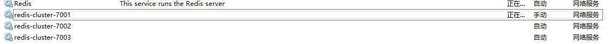

# redis-cluster

- [Redis 3.2.1集群搭建](https://www.cnblogs.com/yuanermen/p/5717885.html)
- [Windows下搭建Redis集群](https://www.cnblogs.com/tommy-huang/p/6240083.html)


## windows下安装redis-cluster
redis 3.2.100: <https://github.com/microsoftarchive/redis/releases>

假设cluster-nodes端口: 7001、7002、7003。

修改`redis.windows-service.conf`中
```editorconfig
##### redis.windows-service.conf

# (windows不支持)redis后台运行
daemonize   yes
# (windows不支持)pidfile文件对应7000,7002,7003             
pidfile  /var/run/redis_7000.pid
# redis端口 
port  7000
# 开启集群
cluster-enabled  yes
# 集群的配置  配置文件首次启动自动生成
cluster-config-file  nodes_7000.conf
# 请求超时
cluster-node-timeout  10000
# aof日志开启  有需要就开启，它会每次写操作都记录一条日志
appendonly  yes
```

将redis-cluster-node添加到windows-service，指定配置文件为`redis.windows-service.conf`，windows-service名称`redis-cluster-7000`。
```CMD
..\Redis Cluster>cd redis-cluster-7002

..\Redis Cluster\redis-cluster-7002>redis-server.exe --service-install redis.windows-service.conf  --service-name redis-cluster-7000
```

通过windows查看服务列表可以发现已经存在: 



因为服务中存在多个redis现在访问`redis-cli`需要指定端口: 
```CMD
# -c 表示 cluster
# -p 表示 port 端口号

..\Redis Cluster\redis-cluster-7003>redis-cli -c -p 7003
127.0.0.1:7003>
```